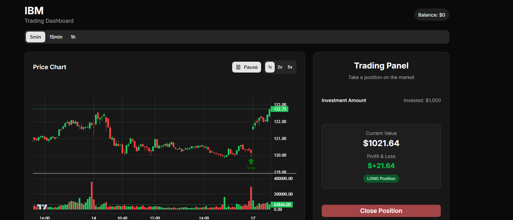
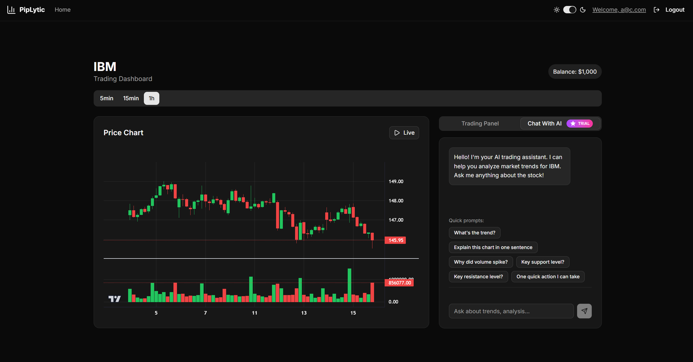

> **Status:** Under heavy development; not production-ready

# PipLytic: Historical Data Trading Simulator

## Overview

PipLytic is a full-stack trading simulator designed to help users practice trading strategies using historical market data in a risk-free environment. The platform provides a realistic trading experience, complete with professional charting, position management, and real-time profit/loss calculations.

## Architecture

PipLytic is built with a modern, scalable architecture:

- **Frontend:** React 19 (TypeScript), Vite, TailwindCSS, Radix UI, TradingView Lightweight Charts
- **Backend:** ASP.NET Core 9, Entity Framework Core, PostgreSQL
- **API:** RESTful endpoints for authentication, user management, market data, and trading
- **Data Source:** Historical market data fetched from TwelveData API and cached in memory for performance

## Key Features

### Historical Data Simulation
- Practice trading with real past market movements
- Selectable intervals: 5min, 15min, 1h
- Adjustable playback speeds: 1x, 2x, 5x
- Data is split into 'past' and 'future' chunks for simulation realism

### Trading Functionality
- Virtual balance ($1,000 starting)
- Position types: LONG (buy), SHORT (sell)
- Position sizing: 25%, 50%, 75%, MAX
- Real-time P&L calculations as data streams
- Trade validation to prevent over-leveraging

### AI-Powered Trading Mentor

- **Interactive Learning Assistant:** Powered by Google Gemini AI, acting as your personal trading mentor
- **Historical Data Analysis:** Helps users understand patterns, trends, and anomalies in past market movements
- **Strategy Education:** Teaches various trading strategies including trend analysis, pattern recognition, and event-impact assessment
- **Guided Discovery:** Uses probing questions to help users reach informed conclusions about trading strategies
- **Context-Aware:** Has access to your current chart data (OHLCV) up to your current time position in the simulation
- **Conversational Learning:** Persistent chat history throughout your trading session for continuous mentorship
- **Usage Tiers:**
  - Free tier: Limited AI queries per session
  - Premium tier: Unlimited AI mentor access
- Session expires when market data refreshes to maintain accuracy

### Charting & Analytics
- Professional candlestick charts with volume indicators
- Responsive design for all devices
- Position markers for active trades
- Trading history and analytics dashboard

### Authentication & User Management
- Email/password registration and login
- JWT-based authentication with automatic token refresh
- Session persistence via HTTP-only cookies
- Personalized user dashboards and trading history

### UI/UX
- Dark/light theme toggle with system preference detection
- Mobile-first, responsive design
- Accessible UI primitives (Radix UI)

## Server Implementation

- **Framework:** ASP.NET Core 9
- **Database:** PostgreSQL, managed via Entity Framework Core migrations
- **Authentication:** JWT tokens, refresh tokens, secure password hashing
- **Market Data:** Fetched from TwelveData API, cached in memory for fast access
- **Business Logic:**
	- Trades and users persisted in PostgreSQL
	- Market data is not stored long-term, only cached in memory
	- Trade simulation logic calculates P&L in real time
- **CORS:** Configured for local React development

## Data Models

- **User:** ID, email, password hash, refresh token, trades
- **Trade:** ID, user ID, symbol, type (long/short), invested amount, final amount, timestamps
- **Market Data:** Symbol, interval, OHLCV values, meta info

## API Endpoints (Selected)

- `POST /auth/register` — Register new user
- `POST /auth/login` — Login and receive JWT
- `POST /auth/refresh-token` — Refresh JWT
- `POST /auth/logout` — Logout and clear session
- `GET /users/me` — Get current user profile
- `GET /users/{id}/trades` — Get user's trading history
- `POST /market/stocks/search` — Fetch historical stock data
- `POST /users/{id}/trades/start` — Start a new trade
- `POST /users/{id}/trades/end` — End/close a trade
- `POST /api/ai-chat` — Send message to AI assistant
- `GET /api/ai-chat` — Get AI chat history

## Technical Highlights

- React 19 with concurrent features for smooth UI
- Vite for fast development and builds
- TradingView Lightweight Charts for professional charting
- Context-based state management (UserContext, ThemeProvider)
- Secure authentication and session management
- Google Gemini AI integration for intelligent trading assistance
- In-memory chat history caching with per-user session management
- Clean separation of concerns in both client and server

## Development Status

- Under heavy development; not production-ready

---
For further details, see the client and server folders.

